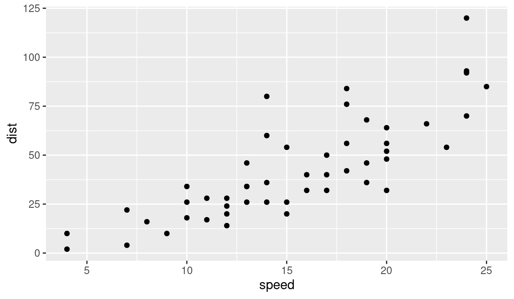
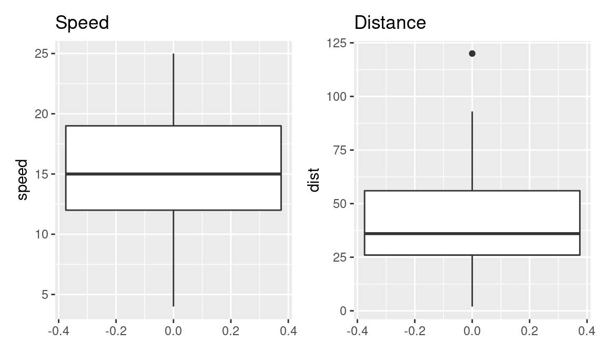
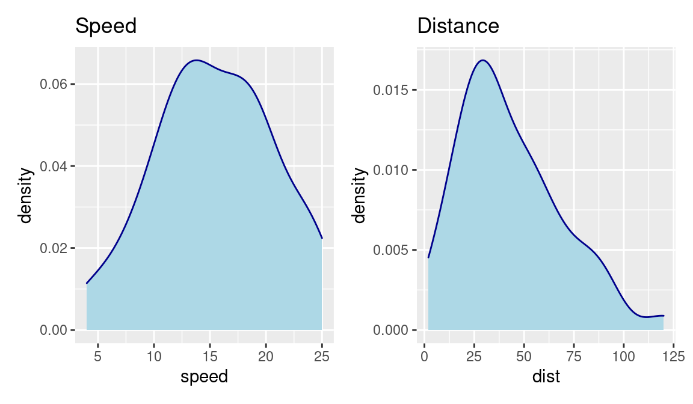
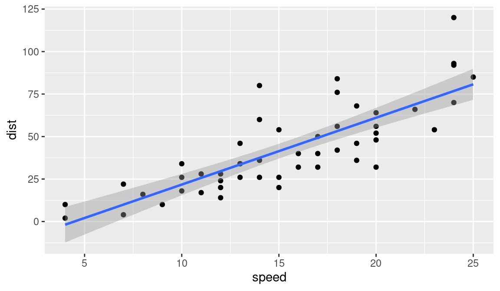
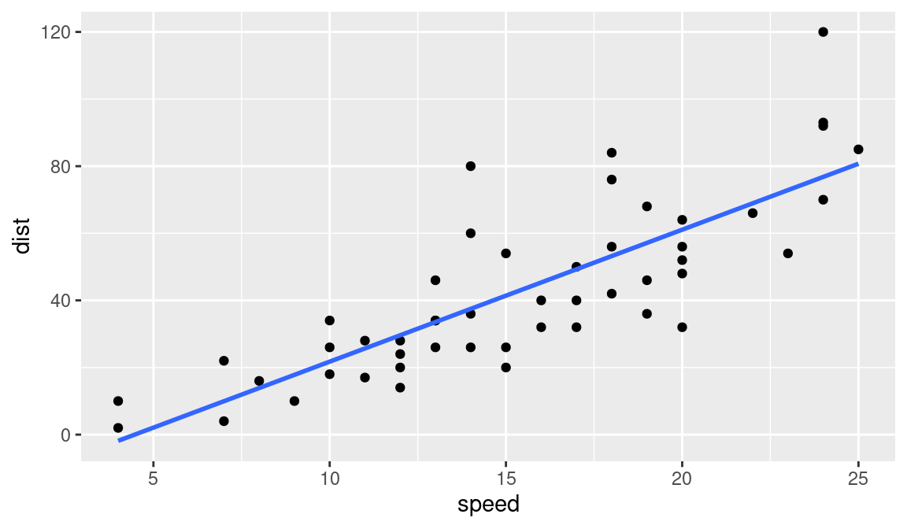

#  Simple Linear Regression


Simple linear regression lives up to its name: it is a very straightforward approach for predicting a quantitative response Y on the basis of a single predictor variable X. It assumes that there is approximately a linear relationship between X and Y as:

$$ Y=\beta_0+ \beta_1X+\epsilon(1) $$

where:

Y dependent variable

X independent variable

$\beta_0$ is the intercept

$\beta_1$ is the coefficient (slope term) representing the linear relationship

$\epsilon$is a mean-zero random error term.


We have covered the basic concepts about linear regression. Besides these, you need to understand that linear regression is based on certain underlying assumptions that must be taken care especially when working with multiple Xs. Once you are familiar with that, the advanced regression models will show you around the various special cases where a different form of regression would be more suitable.


## Example Problem

For this analysis, we will use the cars dataset that comes with R by default.

cars is a standard built-in dataset, that makes it convenient to show linear regression in a simple and easy to understand fashion.

You can access this dataset by typing in cars in your R console.

You will find that it consists of 50 observations(rows) and 2 variables (columns) dist and speed. Lets print out the first six observations here.


```r
# Load the Cars dataset from the Library. Cars data is an inbuilt dataset in R
library(datasets)
data(cars)

head(cars)  # display the first 6 observations
```

The goal here is to establish a mathematical equation for dist as a function of speed, so you can use it to predict dist when only the speed of the car is known.

So it is desirable to build a linear regression model with the response variable as dist and the predictor as speed.

Before we begin building the regression model, it is a good practice to analyse and understand the variables.

The graphical analysis and correlation study below will help with this.

## Graphical Analysis

- Scatter plot


```r
library(tidyverse)
```

```
## ── Attaching packages ─────────────────────────────────────────────────────────────────────────────────────────────────────── tidyverse 1.3.1 ──
```

```
## ✓ ggplot2 3.3.5     ✓ purrr   0.3.4
## ✓ tibble  3.1.6     ✓ dplyr   1.0.8
## ✓ tidyr   1.2.0     ✓ stringr 1.4.0
## ✓ readr   2.1.2     ✓ forcats 0.5.1
```

```
## ── Conflicts ────────────────────────────────────────────────────────────────────────────────────────────────────────── tidyverse_conflicts() ──
## x dplyr::filter() masks stats::filter()
## x dplyr::lag()    masks stats::lag()
```

```r
ggplot(cars, aes(x=speed,y=dist))+ geom_point()
```



- Boxplot

```r
library(patchwork)

# boxplot

p1 <- ggplot(cars, aes(y=speed))+ geom_boxplot() + ggtitle("Speed")  # speed

p2 <- ggplot(cars, aes(y=dist))+ geom_boxplot() + ggtitle("Distance") # Distance


p1 + p2 
```




- Density plot


```r
p3 <- ggplot(cars, aes(x=speed)) + 
  geom_density(color="darkblue", fill="lightblue") + 
  ggtitle("Speed")  # speed

p4 <- ggplot(cars, aes(x=dist))+ 
  geom_density(color="darkblue", fill="lightblue") + 
  ggtitle("Distance") # Distance


p3 + p4 
```



## Correlation Analysis
Correlation analysis studies the strength of relationship between two continuous variables. It involves computing the correlation coefficient between the the two variables.

So what is correlation? And how is it helpful in linear regression?

Correlation is a statistical measure that shows the degree of linear dependence between two variables.

In order to compute correlation, the two variables must occur in pairs, just like what we have here with speed and dist.

Correlation can take values between -1 to +1.

If one variables consistently increases with increasing value of the other, then they have a strong positive correlation (value close to +1).

Similarly, if one consistently decreases when the other increase, they have a strong negative correlation (value close to -1).

A value closer to 0 suggests a weak relationship between the variables.

A low correlation (-0.2 < x < 0.2) probably suggests that much of variation of the response variable (Y) is unexplained by the predictor (X). In that case, you should probably look for better explanatory variables.

If you observe the cars dataset in the R console, for every instance where speed increases, the distance also increases along with it.

That means, there is a strong positive relationship between them. So, the correlation between them will be closer to 1.

However, correlation doesn’t imply causation.

In other words, if two variables have high correlation, it does not mean one variable ’causes’ the value of the other variable to increase.

Correlation is only an aid to understand the relationship. You can only rely on logic and business reasoning to make that judgement.

So, how to compute correlation in R?

Simply use the cor() function with the two numeric variables as arguments.


```r
cor(cars$speed, cars$dist) # calculate correlation between speed and distance
```

```
## [1] 0.8068949
```

## Building the Linear Regression Model

Now that you have seen the linear relationship pictorially in the scatter plot and through correlation, let’s try building the linear regression model.

The function used for building linear models is lm().

The lm() function takes in two main arguments:

    -Formula
    -Data

The data is typically a data.frame object and the formula is a object of class formula.

But the most common convention is to write out the formula directly as written below.


```r
linearMod <- lm(dist ~ speed, data=cars)  # build linear regression model on full data
linearMod
```

```
## 
## Call:
## lm(formula = dist ~ speed, data = cars)
## 
## Coefficients:
## (Intercept)        speed  
##     -17.579        3.932
```

By building the linear regression model, we have established the relationship between the predictor 
and response "in" the form of a mathematical formula.

That is Distance (dist) as a "function for" speed.


## Linear Regression Diagnostics

Now the linear model is built and you have a formula that you can use to predict the dist value if a corresponding speed is known.

Is this enough to actually use this model? NO!

Because, before using a regression model to make predictions, you need to ensure that it is statistically significant. But How do you ensure this?

Lets begin by printing the summary statistics for linearMod


```
## 
## Call:
## lm(formula = dist ~ speed, data = cars)
## 
## Residuals:
##     Min      1Q  Median      3Q     Max 
## -29.069  -9.525  -2.272   9.215  43.201 
## 
## Coefficients:
##             Estimate Std. Error t value Pr(>|t|)    
## (Intercept) -17.5791     6.7584  -2.601   0.0123 *  
## speed         3.9324     0.4155   9.464 1.49e-12 ***
## ---
## Signif. codes:  0 '***' 0.001 '**' 0.01 '*' 0.05 '.' 0.1 ' ' 1
## 
## Residual standard error: 15.38 on 48 degrees of freedom
## Multiple R-squared:  0.6511,	Adjusted R-squared:  0.6438 
## F-statistic: 89.57 on 1 and 48 DF,  p-value: 1.49e-12
```


```r
# capture model summary as an object
modelSummary <- summary(linearMod)  

typeof(modelSummary)
```

```
## [1] "list"
```

```r
names(modelSummary)  
```

```
##  [1] "call"          "terms"         "residuals"     "coefficients" 
##  [5] "aliased"       "sigma"         "df"            "r.squared"    
##  [9] "adj.r.squared" "fstatistic"    "cov.unscaled"
```


```r
# model coefficients
modelCoeffs <- modelSummary$coefficients  

# get std.error for speed  
std.error <- modelCoeffs["speed", "Std. Error"]

modelSummary$sigma
```

```
## [1] 15.37959
```


```r
ggplot(cars, aes(x=speed,y=dist))+ geom_point() +
  geom_smooth(method='lm')
```

```
## `geom_smooth()` using formula 'y ~ x'
```




```r
ggplot(cars, aes(x=speed,y=dist))+ geom_point() +
  geom_smooth(method='lm', se=FALSE)
```

```
## `geom_smooth()` using formula 'y ~ x'
```



## Predicting Linear Models

So far you have seen how to build a linear regression model using the whole dataset. If you build it that way, there is no way to tell how the model will perform with new data.

So the preferred practice is to split your dataset into a 80:20 sample (training:test), then, build the model on the 80% sample and then use the model thus built to predict the dependent variable on test data.

Doing it this way, we will have the model predicted values for the 20% data (test) as well as the actuals (from the original dataset).

By calculating accuracy measures (like min_max accuracy) and error rates (MAPE or MSE), you can find out the prediction accuracy of the model.

Now, lets see how to actually do this.

**Step 1: Create the training and test data**

This can be done using the sample() function. Just make sure you set the seed using set.seed() so the samples can be recreated for future use.


```r
# Create Training and Test data -
set.seed(100)  # setting seed to reproduce results of random sampling
trainingRowIndex <- sample(1:nrow(cars), 0.8*nrow(cars))  # row indices for training data
trainingData <- cars[trainingRowIndex, ]  # model training data
testData  <- cars[-trainingRowIndex, ]   # test data
```

**Step 2: Fit the model on training data and predict dist on test data**


```r
# Build the model on training data
lmMod <- lm(dist ~ speed, data=trainingData)  # build the model
distPred <- predict(lmMod, testData)  # predict distance
```

**Step 3: Review diagnostic measures**


```r
summary (lmMod)  # model summary
```

```
## 
## Call:
## lm(formula = dist ~ speed, data = trainingData)
## 
## Residuals:
##     Min      1Q  Median      3Q     Max 
## -24.726 -11.242  -2.564  10.436  40.565 
## 
## Coefficients:
##             Estimate Std. Error t value Pr(>|t|)    
## (Intercept) -20.1796     7.8254  -2.579   0.0139 *  
## speed         4.2582     0.4947   8.608 1.85e-10 ***
## ---
## Signif. codes:  0 '***' 0.001 '**' 0.01 '*' 0.05 '.' 0.1 ' ' 1
## 
## Residual standard error: 15.49 on 38 degrees of freedom
## Multiple R-squared:  0.661,	Adjusted R-squared:  0.6521 
## F-statistic: 74.11 on 1 and 38 DF,  p-value: 1.848e-10
```

From the model summary, the model p value and predictors p value are less than the significance level.

So you have a statistically significant model.

Also, the R-Sq and Adj R-Sq are comparative to the original model built on full data.


**Step 4: Calculate prediction accuracy and error rates**

A simple correlation between the actuals and predicted values can be used as a form of accuracy measure.

A higher correlation accuracy implies that the actuals and predicted values have similar directional movement, i.e. when the actuals values increase the predicted values also increase and vice-versa.


```r
original <-  testData$dist
d = original-distPred
mse = mean((d)^2)
mae = mean(abs(d))
rmse = sqrt(mse)
R2 = 1-(sum((d)^2)/sum((original-mean(original))^2))

cat(" MAE:", mae, "\n", "MSE:", mse, "\n", 
    
    "RMSE:", rmse, "\n", "R-squared:", R2)
```

```
##  MAE: 12.50694 
##  MSE: 267.0002 
##  RMSE: 16.34014 
##  R-squared: 0.5142005
```

